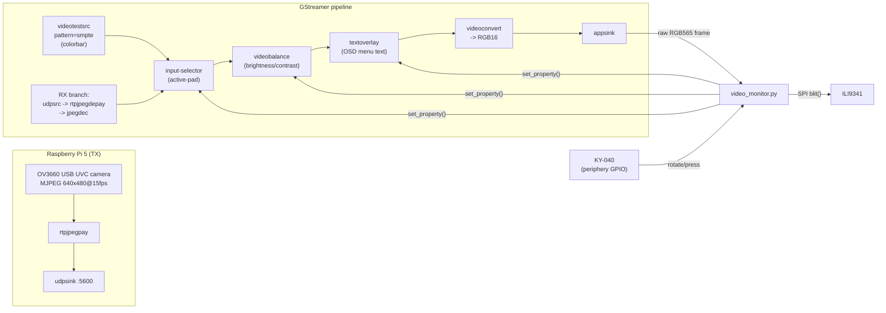

# Luckfox Lyra Plus (RK3506G2) — video monitor (ILI9341 + KY-040)

**Goal:** a little video-monitor device. Input is a GStreamer video stream (RX)
sent over the network from a **Raspberry Pi 5 TX** with a USB UVC camera
(OV3660, 2048x1536/15fps, MJPEG), output is an ILI9341, and there's a built-in
color-bar test pattern you can flip to. The KY-040 rotates through inputs and
(via a push-to-enter OSD menu) adjusts brightness/contrast.

**Status:** revised plan (see "Architecture" below) — this pivoted from the
original plain SPI-driven counter demo once "video RX + colorbar + OSD menu"
came into scope, then the codec was pinned down once the TX side (Raspberry Pi
5 + this specific camera) was known. `demo.py`/`ili9341.py`/`ky040.py` from
that phase are still here and still useful as a wiring smoke test;
`video_monitor.py` is the new main app.

## Codec choice: MJPEG over RTP/UDP

The camera ([OV3660 USB UVC module](https://www.amazon.co.jp/dp/B0CNZG5PVM))
is a cheap UVC webcam. At 2048x1536 it can only realistically be streaming
MJPEG over USB2.0 - raw YUY2 at that resolution/framerate would need
`2048*1536*2*15 ≈ 94MB/s`, way past USB2.0's ~35MB/s effective throughput, so
the UVC descriptor almost certainly only offers that size as MJPEG (uncompressed
modes, if present at all, will be at much lower resolution).

Given the camera already natively produces MJPEG, and the RX side (Luckfox
Lyra Plus, Cortex-A7, **no hardware video decoder**) needs to decode every
frame in software, MJPEG is also the *cheapest* option to decode - no motion
compensation, no CABAC/entropy-coded inter-frame prediction like H.264, just
per-frame IDCT. It also has a nice side benefit for a UDP link: MJPEG frames
are independent, so a dropped packet only corrupts one frame instead of an
entire H.264 GOP. Re-encoding to H.264 on the Pi 5 would only trade lower
bandwidth for a decode+encode CPU cost on *both* ends and worse loss behavior -
not worth it at this resolution/frame rate. So: **MJPEG in, MJPEG out, no
transcoding**, packetized as RTP (`rtpjpegpay`/`rtpjpegdepay`) over UDP.

## Architecture

Rather than hand-rolling video decode/scaling/blending in Python (way too slow
on a Cortex-A7 with no hardware video decoder here), the plan leans entirely on
**GStreamer** to do the pixel-pushing in optimized C, and keeps the Python side
to two thin jobs: wiring KY-040 events to GStreamer element properties, and
copying finished frames from an `appsink` to the ILI9341 over SPI.



- `input-selector` switches between the color-bar test source and the decoded
  RX video with zero Python-side pixel work.
- `videobalance` does brightness/contrast in the pipeline itself (properties:
  `brightness` -1.0..1.0, `contrast` 0.0..2.0) — the knob just nudges these.
- `textoverlay` draws the OSD menu text; toggling its `silent` property
  shows/hides it, so the menu overlay works over *either* input source for free.
- `appsink` is configured `max-buffers=1 drop=true sync=false` so it never
  backs up — always the newest frame, lowest latency, even if SPI is the
  bottleneck (see bandwidth note below).

Files:
- `ili9341.py` — SPI-pushed ILI9341 driver (unchanged from the original demo).
- `ky040.py` — KY-040 rotary encoder + push-button reader (unchanged).
- `video_monitor.py` — **new main app**: builds the GStreamer pipeline above,
  pumps `appsink` frames to the display, and maps KY-040 events to the
  INPUT/BRIGHTNESS/CONTRAST/EXIT OSD menu.
- `demo.py` — original counter demo; keep around as a plain SPI+encoder wiring
  smoke test before bringing GStreamer into the picture.

## Phased rollout

1. **Wiring smoke test (done)** — `demo.py`, confirms SPI/GPIO wiring and
   `luckfox-config` pin assignments work at all, no GStreamer needed yet.
2. **Add GStreamer to the Buildroot image** — not yet done, needs an SDK
   rebuild (see below). Get `video_monitor.py` running with **only the
   colorbar branch** first (comment out/ignore the RX branch, or point
   `input-selector` permanently at `sink_0`) to validate `videobalance` +
   `textoverlay` + `appsink` → SPI end-to-end without needing a live RX stream.
3. **Bring up the TX side** on the Raspberry Pi 5 (see "TX side" section below)
   and confirm `video_monitor.py`'s `RX_PIPELINE_FRAGMENT` (MJPEG/RTP/UDP,
   already filled in) matches - just the host/port need to line up.
4. **Tune for real-time**: raise the SPI clock via `luckfox-config` (see
   bandwidth note), confirm the Cortex-A7 can software-decode MJPEG at your
   chosen resolution/fps in real time, and drop resolution/fps if not.

## 1. Wire it up

The Lyra Plus doesn't have fixed SPI/GPIO pins broken out by default — `RM_IOx`
pins are muxed to different peripherals with the **`luckfox-config`** tool
(no reboot needed for SPI/GPIO changes). On the board's serial/SSH console:

```bash
luckfox-config
```

1. **Advanced Options → SPI → SPI0 → enable**, then assign:
   - CLK → `RMIO24`
   - MOSI → `RMIO25`
   - MISO → `RMIO26` (not used by the ILI9341, but the mux still needs one)
   - CS → `RMIO27`

   This is Luckfox's own documented example mapping, and it lines up with header
   pins 41/42/43/50 on the Lyra Plus pin diagram. Confirm it after saving with:

   ```bash
   luckfox-config show
   ls /sys/bus/spi/devices/          # should show spi0.0
   ```

2. Leave two more `RM_IO` pins as plain GPIO for the display's **DC** (data/command)
   and **RST** (reset) lines — e.g. `RMIO28` and `RMIO29`. Anything not claimed by a
   peripheral in `luckfox-config` shows up as a bare GPIO in `luckfox-config show`.

3. Leave three more free `RM_IO` pins as plain GPIO for the KY-040: **CLK**, **DT**,
   **SW** — e.g. `RMIO2`, `RMIO3`, `RMIO4`.

4. Run `luckfox-config show` and note the **sysfs GPIO numbers** it prints for the
   DC/RST/CLK/DT/SW pins (something like `gpio41`, `gpio64`, ...). Every board/dtb
   combo can differ, so don't hardcode numbers from someone else's board — read them
   off your own `luckfox-config show` output.

5. Wiring:
   - ILI9341: `VCC`→3.3V, `GND`→GND, `CS`→CS pin from step 1, `RESET`→RST GPIO,
     `DC`(a.k.a. `A0`/`RS`)→DC GPIO, `SDI(MOSI)`→MOSI, `SCK`→CLK, `LED`→3.3V
     (or a spare 3.3V-tolerant PWM pin if you want backlight control later),
     `SDO(MISO)`→MISO (optional, only needed if you plan to read the display ID).
   - KY-040: `+`→3.3V, `GND`→GND, `CLK`/`DT`/`SW`→the three GPIOs from step 3.
   - KY-040 boards are often missing pull-ups on `CLK`/`DT`/`SW`. If the encoder
     reads jittery/skips steps, add 10kΩ pull-ups to 3.3V on those three lines
     (the `periphery` sysfs GPIO API on this board doesn't expose per-pin bias
     configuration, so software pull-ups aren't available here).

## 2. Fill in the pin numbers

Edit the `CONFIG` block at the top of `demo.py` **and** `video_monitor.py` with the
GPIO numbers you read from `luckfox-config show`, e.g.:

```python
CONFIG = {
    "spi_bus": 0,
    "spi_device": 0,
    "spi_max_hz": 24_000_000,  # see bandwidth note below - default 10MHz is too slow for video
    "dc_gpio": 64,
    "rst_gpio": 65,
    "enc_clk_gpio": 96,
    "enc_dt_gpio": 97,
    "enc_sw_gpio": 98,
}
```

## 3. SPI bandwidth note (important for the video path)

A 320x240 RGB565 frame is `320*240*2 = 153,600 bytes`. At the Lyra's documented
default `spi-max-frequency` of 10MHz, the SPI bus alone caps out around
`10,000,000/8/153,600 ≈ 8 fps` — before accounting for command overhead. For the
15fps target, raise the SPI clock in `luckfox-config` (Advanced Options → SPI →
set speed) to something like 24-32MHz and set `spi_max_hz` to match. Short,
direct jumper wires help a lot at these speeds; long breadboard leads may force
you to back the clock down. If frames still can't keep up, drop resolution/fps
in `video_monitor.py` (`WIDTH`, `HEIGHT`, `FPS`) before assuming the CPU decode
itself is the bottleneck.

## 4. TX side (Raspberry Pi 5 + OV3660 UVC camera)

First check what modes the camera actually advertises over UVC - cheap MJPEG
cameras almost always support a VGA mode too, not just their max resolution:

```bash
v4l2-ctl --list-formats-ext -d /dev/video0
```

320x240 on the ILI9341 is 4:3, and so is this camera's native 2048x1536 - so
aim for a 4:3 capture size that cleanly downscales, e.g. **640x480** (exactly
2x the panel resolution). If `640x480` MJPEG is listed, this is the whole TX
pipeline - pure repackaging, no decode/encode CPU cost at all:

```bash
gst-launch-1.0 -v v4l2src device=/dev/video0 \
  ! image/jpeg,width=640,height=480,framerate=15/1 \
  ! rtpjpegpay ! udpsink host=<lyra-ip> port=5600 sync=false
```

If 640x480 MJPEG isn't offered (only the max resolution is), decode + scale +
re-encode instead - the Pi 5's quad Cortex-A76 has plenty of headroom for JPEG
work at this size:

```bash
gst-launch-1.0 -v v4l2src device=/dev/video0 \
  ! image/jpeg,width=2048,height=1536,framerate=15/1 \
  ! jpegdec ! videoconvert ! videoscale \
  ! video/x-raw,width=640,height=480 \
  ! jpegenc quality=75 ! rtpjpegpay ! udpsink host=<lyra-ip> port=5600 sync=false
```

Replace `<lyra-ip>` with the Lyra Plus's actual IP and make sure it matches the
`udpsrc port=5600` in `video_monitor.py`'s `RX_PIPELINE_FRAGMENT`. Once this is
working reliably, it's a good candidate for a `systemd` unit on the Pi so it
starts automatically on boot - not needed to get a first picture though.

## 5. Buildroot packages needed for `video_monitor.py`

GStreamer + PyGObject aren't in the default Lyra image - they need enabling in
the Luckfox Lyra Buildroot SDK (`make menuconfig` in the SDK checkout, then
rebuild and reflash). MJPEG keeps this list lighter than an H.264 path would
have (no `gst1-libav`/ffmpeg needed):

- `BR2_PACKAGE_GSTREAMER1`
- `BR2_PACKAGE_GST1_PLUGINS_BASE` (videotestsrc, videoconvert, videoscale,
  input-selector, appsink, and the `pango`-based `textoverlay` sub-option -
  make sure `BR2_PACKAGE_PANGO` is enabled too)
- `BR2_PACKAGE_GST1_PLUGINS_GOOD` (`videobalance`, `udpsrc`, `rtpjpegdepay`,
  and `jpegdec`/`jpegenc` from the "jpeg" plugin - pulls in `libjpeg-turbo` as
  a dependency, which Buildroot handles automatically)
- `BR2_PACKAGE_PYTHON3`, `BR2_PACKAGE_PYTHON_PYGOBJECT`,
  `BR2_PACKAGE_GOBJECT_INTROSPECTION` (needed for `gi.repository.Gst` from
  Python)

**Known risk:** cross-compiling `gobject-introspection` in Buildroot is a
known pain point (it needs to run target binaries during the scan step, so it
relies on Buildroot's QEMU-based introspection support). If that turns out to
be too unreliable to get building, **Plan B** is to drop PyGObject entirely and
reimplement `video_monitor.py`'s pipeline control in a small C program against
libgstreamer-1.0 directly (no introspection needed for the C API) - the
pipeline string and property names stay identical, only the glue language
changes.

## 6. Run it

Copy the folder to the board (`scp -r gar-stream-rx root@<board-ip>:/root/`).

Wiring/SPI smoke test first (no GStreamer needed):

```bash
python3 demo.py
```

Then the real video monitor, once GStreamer/PyGObject are on the image and the
pin CONFIG is filled in:

```bash
python3 video_monitor.py
```

- Rotate the knob in normal view: toggles between the color bar and the RX
  input.
- Press the knob: opens the OSD menu (`INPUT` / `BRIGHTNESS` / `CONTRAST` /
  `EXIT`). Rotate to move the highlighted line, press to enter "adjust" on
  that line (rotate changes the value live), press again to confirm and go
  back to the list. Selecting `EXIT` and pressing closes the menu.

## Troubleshooting

- **Colors look swapped (red/blue)**: set `bgr=False` in the `ILI9341(...)` call.
- **Image is mirrored/rotated wrong**: change `rotation=` (0-3) in the same call.
- **Nothing draws / `PermissionError` on `/dev/spidev0.0`**: run as root, or check
  the device actually exists (`ls /dev/spidev*`) — it only appears after `luckfox-config`
  enables SPI0.
- **Encoder skips or double-counts**: add the 10kΩ pull-ups mentioned above, or
  lower `bounce_ms` in `ky040.py` if it's the opposite problem (missed fast turns).
- **Video is choppy / falling behind**: see the SPI bandwidth note above first;
  if the SPI clock is already maxed out, JPEG decode itself may be the
  bottleneck at higher resolutions - drop the TX capture size (e.g. 640x480 →
  320x240) rather than the frame rate first, since it's a bigger win for both
  network bandwidth and decode cost.
- **`gi.repository.Gst` import fails**: PyGObject/gobject-introspection isn't in
  the image yet - see the Buildroot packages section above.
- **No RX picture but colorbar works fine**: check the Pi 5's `gst-launch-1.0`
  process is actually running and pointed at the Lyra's current IP (DHCP leases
  change), and that nothing's blocking UDP port 5600 between them (same subnet
  is simplest - routing MJPEG/RTP across VLANs/NAT adds its own headaches).
