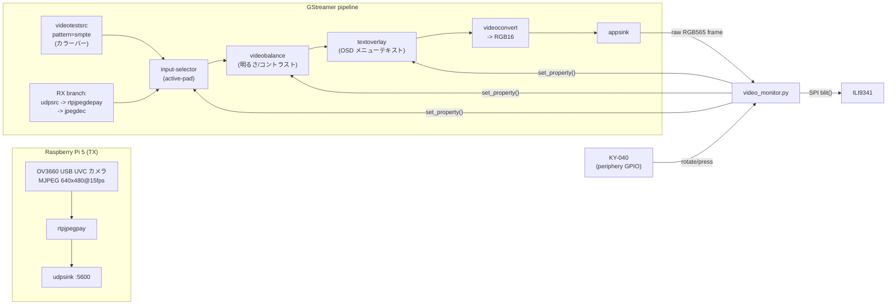

# Luckfox Lyra Plus (RK3506G2) — ビデオモニター (ILI9341 + KY-040)

**目的:** 小さなビデオモニター装置を作ること。入力は **Raspberry Pi 5 (TX)** に
接続した USB UVC カメラ (OV3660, 2048x1536/15fps, MJPEG) からネットワーク経由で
送られてくる GStreamer のビデオストリーム (RX)。出力は ILI9341 で、内蔵のカラー
バーテストパターンに切り替えることもできる。KY-040 で入力を順に切り替え、
(プッシュで開く OSD メニュー経由で) 明るさ/コントラストを調整する。

**ステータス:** 計画を改訂 (下の「アーキテクチャ」参照) — もともとは単純な
SPI 駆動のカウンターデモだったが、「ビデオ RX + カラーバー + OSD メニュー」が
スコープに入ったところで方向転換し、その後 TX 側 (Raspberry Pi 5 + 今回の特定の
カメラ) が判明した時点でコーデックを確定させた。そのフェーズの
`demo.py`/`ili9341.py`/`ky040.py` は今も残っており、配線の動作確認用として
引き続き有用。`video_monitor.py` が新しいメインアプリ。

## コーデックの選択: RTP/UDP 上の MJPEG

カメラ ([OV3660 USB UVC モジュール](https://www.amazon.co.jp/dp/B0CNZG5PVM)) は
安価な UVC ウェブカメラ。2048x1536 では、現実的には USB2.0 上で MJPEG を
ストリーミングするしかない — この解像度/フレームレートで生の YUY2 を送るには
`2048*1536*2*15 ≈ 94MB/s` が必要で、USB2.0 の実効スループット (約 35MB/s) を
大幅に超えてしまう。そのため UVC ディスクリプタはこのサイズをほぼ確実に
MJPEG としてのみ提供している (無圧縮モードがあったとしても、もっと低い解像度に
限られるはず)。

カメラがもともとネイティブに MJPEG を生成していること、そして RX 側
(Luckfox Lyra Plus, Cortex-A7, **ハードウェアビデオデコーダなし**) が全フレームを
ソフトウェアでデコードする必要があることを考えると、MJPEG はデコードの面でも
*最も安上がり*な選択肢になる — H.264 のような動き補償や CABAC/エントロピー
符号化されたフレーム間予測がなく、フレームごとの IDCT だけで済む。さらに UDP
リンクにとって嬉しい副次効果もある: MJPEG フレームは独立しているので、
パケットが1つ落ちても壊れるのは1フレームだけで、H.264 の GOP 全体が壊れることは
ない。Pi 5 側で H.264 に再エンコードすると、帯域幅が下がる代わりに両端に
デコード+エンコードの CPU コストが発生し、ロス時の挙動も悪化する — この
解像度/フレームレートではその価値はない。というわけで: **MJPEG で受けて
MJPEG のまま出す、トランスコードなし**。RTP (`rtpjpegpay`/`rtpjpegdepay`) で
UDP 上にパケット化する。

## アーキテクチャ

ビデオのデコード/スケーリング/合成を Python で自前実装するのではなく
(ハードウェアビデオデコーダのない Cortex-A7 ではあまりに遅すぎる)、この計画は
**GStreamer** に画素処理を最適化された C コードで任せ、Python 側は2つの
軽い役割に留める: KY-040 のイベントを GStreamer エレメントのプロパティに
配線することと、`appsink` から出来上がったフレームを SPI 経由で ILI9341 に
コピーすること。



- `input-selector` は、カラーバーのテストソースとデコードされた RX 映像を
  Python 側での画素処理ゼロで切り替える。
- `videobalance` はパイプライン自体の中で明るさ/コントラストを処理する
  (プロパティ: `brightness` -1.0〜1.0, `contrast` 0.0〜2.0) — ノブはこれらを
  微調整するだけ。
- `textoverlay` が OSD メニューのテキストを描画する。`silent` プロパティを
  切り替えることで表示/非表示ができるので、メニューのオーバーレイは
  *どちらの*入力ソースの上でもそのまま機能する。
- `appsink` は `max-buffers=1 drop=true sync=false` に設定されているため、
  決して滞留しない — SPI がボトルネックになっていても (下の帯域幅の注記を
  参照)、常に最新のフレーム・最低遅延を保つ。

ファイル構成:
- `ili9341.py` — SPI で描画する ILI9341 ドライバ (元のデモから変更なし)。
- `ky040.py` — KY-040 ロータリーエンコーダ + プッシュボタンの読み取り
  (変更なし)。
- `video_monitor.py` — **新しいメインアプリ**: 上記の GStreamer パイプラインを
  構築し、`appsink` のフレームをディスプレイに送り、KY-040 のイベントを
  INPUT/BRIGHTNESS/CONTRAST/EXIT の OSD メニューにマッピングする。
- `demo.py` — 元のカウンターデモ。GStreamer を導入する前の、素の SPI +
  エンコーダ配線の動作確認用として残してある。

## 段階的な展開

1. **配線の動作確認 (完了)** — `demo.py` で SPI/GPIO の配線と
   `luckfox-config` のピン割り当てがそもそも機能するかを確認する。まだ
   GStreamer は不要。
2. **Buildroot イメージに GStreamer を追加** — 未完了。SDK の再ビルドが必要
   (下記参照)。まずは **カラーバー分岐だけ**で `video_monitor.py` を動かし
   (RX 分岐をコメントアウト/無視するか、`input-selector` を常に `sink_0` に
   固定する)、ライブの RX ストリームなしで `videobalance` + `textoverlay` +
   `appsink` → SPI がエンドツーエンドで動くことを確認する。
3. Raspberry Pi 5 側で **TX を立ち上げ** (下の「TX 側」節を参照)、
   `video_monitor.py` の `RX_PIPELINE_FRAGMENT` (MJPEG/RTP/UDP、すでに記入済み)
   と一致することを確認する — あとはホスト/ポートを合わせるだけ。
4. **リアルタイム性のチューニング**: `luckfox-config` で SPI クロックを
   上げ (帯域幅の注記を参照)、Cortex-A7 が選んだ解像度/fps で MJPEG を
   リアルタイムにソフトウェアデコードできるか確認し、できなければ
   解像度/fps を下げる。

## 1. 配線する

Lyra Plus はデフォルトで SPI/GPIO ピンが固定で出ているわけではない —
`RM_IOx` ピンは **`luckfox-config`** ツールで各種周辺機能にマルチプレクスされる
(SPI/GPIO の変更に再起動は不要)。ボードのシリアル/SSH コンソールで:

```bash
luckfox-config
```

1. **Advanced Options → SPI → SPI0 → enable** としてから、以下を割り当てる:
   - CLK → `RMIO24`
   - MOSI → `RMIO25`
   - MISO → `RMIO26` (ILI9341 では使わないが、マルチプレクサ上は1本必要)
   - CS → `RMIO27`

   これは Luckfox 公式のドキュメントに載っているマッピング例で、Lyra Plus の
   ピン配置図のヘッダーピン 41/42/43/50 と対応している。保存後に以下で確認:

   ```bash
   luckfox-config show
   ls /sys/bus/spi/devices/          # spi0.0 が表示されるはず
   ```

2. ディスプレイの **DC** (data/command) と **RST** (reset) 用に、あと2本の
   `RM_IO` ピンを素の GPIO として残しておく — 例えば `RMIO28` と `RMIO29`。
   `luckfox-config` で周辺機能に割り当てられていないピンは、
   `luckfox-config show` 上でただの GPIO として表示される。

3. KY-040 用に、さらに3本の `RM_IO` ピンを素の GPIO として残す:
   **CLK**、**DT**、**SW** — 例えば `RMIO2`、`RMIO3`、`RMIO4`。

4. `luckfox-config show` を実行し、DC/RST/CLK/DT/SW ピンに対して表示される
   **sysfs GPIO 番号** (`gpio41`、`gpio64` のようなもの) を控えておく。
   ボード/dtb の組み合わせによって変わるので、他人のボードの番号を
   ハードコードせず、必ず自分の `luckfox-config show` の出力から読み取ること。

5. 配線:
   - ILI9341: `VCC`→3.3V、`GND`→GND、`CS`→手順1の CS ピン、`RESET`→RST GPIO、
     `DC`(別名 `A0`/`RS`)→DC GPIO、`SDI(MOSI)`→MOSI、`SCK`→CLK、`LED`→3.3V
     (後でバックライト制御をしたい場合は 3.3V 耐圧の余っている PWM ピンでも可)、
     `SDO(MISO)`→MISO (任意。ディスプレイ ID を読みたい場合のみ必要)。
   - KY-040: `+`→3.3V、`GND`→GND、`CLK`/`DT`/`SW`→手順3の3本の GPIO。
   - KY-040 のボードは `CLK`/`DT`/`SW` にプルアップが付いていないことが多い。
     エンコーダの読み取りがガタつく/ステップを飛ばす場合は、この3本の線を
     3.3V に 10kΩ でプルアップする (このボードの `periphery` sysfs GPIO API
     はピンごとのバイアス設定を公開していないため、ソフトウェアプルアップは
     ここでは使えない)。

## 2. ピン番号を記入する

`luckfox-config show` で読み取った GPIO 番号を、`demo.py` **と**
`video_monitor.py` の先頭にある `CONFIG` ブロックに記入する。例:

```python
CONFIG = {
    "spi_bus": 0,
    "spi_device": 0,
    "spi_max_hz": 24_000_000,  # 下の帯域幅の注記を参照 - デフォルトの10MHzはビデオには遅すぎる
    "dc_gpio": 64,
    "rst_gpio": 65,
    "enc_clk_gpio": 96,
    "enc_dt_gpio": 97,
    "enc_sw_gpio": 98,
}
```

## 3. SPI 帯域幅に関する注記 (ビデオ経路にとって重要)

320x240 の RGB565 フレームは `320*240*2 = 153,600 バイト`。Lyra のドキュメント
上のデフォルト `spi-max-frequency` である 10MHz では、SPI バスだけで
`10,000,000/8/153,600 ≈ 8fps` が上限になる — コマンドのオーバーヘッドを
考慮する前の話。15fps の目標を達成するには、`luckfox-config`
(Advanced Options → SPI → set speed) で SPI クロックを 24〜32MHz 程度まで上げ、
`spi_max_hz` をそれに合わせる。この速度では短くまっすぐなジャンパー線が
かなり効くので、ブレッドボードの長いリード線を使う場合はクロックを
下げる必要があるかもしれない。それでもフレームが追いつかない場合は、
CPU デコード自体がボトルネックだと決めつける前に、`video_monitor.py` の
(`WIDTH`, `HEIGHT`, `FPS`) で解像度/fps を下げてみること。

## 4. TX 側 (Raspberry Pi 5 + OV3660 UVC カメラ)

まずカメラが UVC 経由で実際にどのモードを公開しているか確認する — 安価な
MJPEG カメラは、最大解像度だけでなくたいてい VGA モードもサポートしている:

```bash
v4l2-ctl --list-formats-ext -d /dev/video0
```

ILI9341 上の 320x240 はアスペクト比 4:3 で、このカメラのネイティブ解像度
2048x1536 も同じく 4:3 — なのできれいに縮小できる 4:3 のキャプチャサイズ、
例えば **640x480** (パネル解像度のちょうど2倍) を狙う。もし `640x480` の
MJPEG がリストにあれば、TX パイプライン全体はこれだけで済む — 単なる
再パッケージ化で、デコード/エンコードの CPU コストはゼロ:

```bash
gst-launch-1.0 -v v4l2src device=/dev/video0 \
  ! image/jpeg,width=640,height=480,framerate=15/1 \
  ! rtpjpegpay ! udpsink host=<lyra-ip> port=5600 sync=false
```

640x480 の MJPEG が提供されていない (最大解像度しかない) 場合は、代わりに
デコード + スケール + 再エンコードを行う — Pi 5 のクアッド Cortex-A76 なら
このサイズの JPEG 処理に十分な余力がある:

```bash
gst-launch-1.0 -v v4l2src device=/dev/video0 \
  ! image/jpeg,width=2048,height=1536,framerate=15/1 \
  ! jpegdec ! videoconvert ! videoscale \
  ! video/x-raw,width=640,height=480 \
  ! jpegenc quality=75 ! rtpjpegpay ! udpsink host=<lyra-ip> port=5600 sync=false
```

`<lyra-ip>` を Lyra Plus の実際の IP に置き換え、`video_monitor.py` の
`RX_PIPELINE_FRAGMENT` にある `udpsrc port=5600` と一致していることを確認する。
これが安定して動くようになったら、Pi 上で自動起動する `systemd` ユニットに
するのも良い候補 — ただし最初の映像を出すだけならそこまでは不要。

## 5. `video_monitor.py` に必要な Buildroot パッケージ

GStreamer と PyGObject はデフォルトの Lyra イメージには含まれていない —
Luckfox Lyra の Buildroot SDK で有効化する必要がある (SDK のチェックアウト内で
`make menuconfig` を実行し、リビルドして書き込む)。MJPEG のおかげで、
H.264 経路よりもこのリストは軽く済む (`gst1-libav`/ffmpeg は不要):

- `BR2_PACKAGE_GSTREAMER1`
- `BR2_PACKAGE_GST1_PLUGINS_BASE` (videotestsrc, videoconvert, videoscale,
  input-selector, appsink、および `pango` ベースの `textoverlay` サブ
  オプション — `BR2_PACKAGE_PANGO` も有効にしておくこと)
- `BR2_PACKAGE_GST1_PLUGINS_GOOD` (`videobalance`, `udpsrc`, `rtpjpegdepay`、
  および "jpeg" プラグインの `jpegdec`/`jpegenc` — 依存関係として
  `libjpeg-turbo` を引き込むが、これは Buildroot が自動的に処理する)
- `BR2_PACKAGE_PYTHON3`、`BR2_PACKAGE_PYTHON_PYGOBJECT`、
  `BR2_PACKAGE_GOBJECT_INTROSPECTION` (Python から `gi.repository.Gst` を
  使うために必要)

**既知のリスク:** Buildroot で `gobject-introspection` をクロスコンパイルする
のは既知の難所 (スキャンの段階でターゲットバイナリを実行する必要があるため、
Buildroot の QEMU ベースのイントロスペクションサポートに依存する)。もし
これが安定してビルドできないほど厄介だと分かった場合の **プラン B** は、
PyGObject を完全に捨てて、`video_monitor.py` のパイプライン制御を
libgstreamer-1.0 に対する小さな C プログラムとして再実装すること (C API には
イントロスペクションは不要) — パイプライン文字列とプロパティ名はそのままで、
グルー言語だけが変わる。

## 6. 実行する

フォルダをボードにコピーする (`scp -r gar-stream-rx root@<board-ip>:/root/`)。

まず配線/SPI の動作確認 (GStreamer は不要):

```bash
python3 demo.py
```

GStreamer/PyGObject がイメージに入っていて、ピンの CONFIG を記入したら、
本番のビデオモニターを実行する:

```bash
python3 video_monitor.py
```

- 通常表示中にノブを回す: カラーバーと RX 入力を切り替える。
- ノブを押す: OSD メニュー (`INPUT` / `BRIGHTNESS` / `CONTRAST` / `EXIT`) を
  開く。回してハイライトされた行を移動し、押すとその行の「調整」モードに
  入る (回すと値がリアルタイムで変わる)。もう一度押すと確定してリストに
  戻る。`EXIT` を選んで押すとメニューを閉じる。

## トラブルシューティング

- **色が入れ替わって見える (赤/青)**: `ILI9341(...)` の呼び出しで
  `bgr=False` を設定する。
- **映像が反転/回転がおかしい**: 同じ呼び出しの `rotation=` (0〜3) を変更する。
- **何も描画されない / `/dev/spidev0.0` で `PermissionError`**: root で実行するか、
  デバイスが実際に存在するか確認する (`ls /dev/spidev*`) — `luckfox-config`
  で SPI0 を有効化した後にのみ現れる。
- **エンコーダがステップを飛ばす、または二重カウントする**: 上述の 10kΩ
  プルアップを追加するか、逆の問題 (速い回転を取りこぼす) であれば
  `ky040.py` の `bounce_ms` を下げる。
- **映像がカクつく/遅延する**: まず上の SPI 帯域幅の注記を確認する。
  SPI クロックがすでに上限に達している場合は、より高い解像度では JPEG
  デコード自体がボトルネックになっている可能性がある — フレームレートより
  先に TX 側のキャプチャサイズを下げる (例: 640x480 → 320x240) こと。
  ネットワーク帯域とデコードコストの両方にとって、その方が効果が大きい。
- **`gi.repository.Gst` の import が失敗する**: PyGObject/gobject-introspection
  がまだイメージに入っていない — 上の Buildroot パッケージの節を参照。
- **カラーバーは動くが RX の映像が出ない**: Pi 5 の `gst-launch-1.0`
  プロセスが実際に動作していて、Lyra の現在の IP を指しているか
  (DHCP のリースは変わる) 確認する。また、両者の間で UDP ポート 5600 が
  ブロックされていないか確認する (同一サブネットが最も簡単 — VLAN/NAT を
  またいだ MJPEG/RTP のルーティングはそれ自体が面倒の種になる)。
