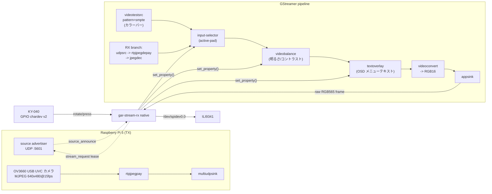

# Luckfox Lyra Plus (RK3506G2) — ビデオモニター (ILI9341 + KY-040)

**目的:** 小さなビデオモニター装置を作ること。入力は **Raspberry Pi 5 (TX)** に
接続した USB UVC カメラ (OV3660, 2048x1536/15fps, MJPEG) をSourceとして自動検出し、
RXから送信要求して受け取るGStreamerビデオストリーム。出力はILI9341で、内蔵のカラー
バーテストパターンにも切り替えられる。KY-040で検出したSourceチャンネルを選択し、
(プッシュで開く OSD メニュー経由で) 明るさ/コントラストを調整する。

**ステータス:** `native/` のC++アプリを正式な実装とし、EC2 Graviton上で
Source検出・lease要求・RTP/JPEGデコード・ILI9341表示・KY-040メニュー操作まで
確認済み。アプリはシミュレーション専用HALを持たず、Linux標準の
`/dev/gpiochip*`、`/dev/spidev*`、UDP socketだけを使用する。EC2向けはaarch64、
Lyra向けはarmv7lとCPU ABIが異なるためバイナリは別ビルドになるが、ソースと
実行ロジックは共通である。Python版は初期PoCと配線診断の参考として残している。

## コーデックの選択: RTP/UDP 上の MJPEG

カメラ ([OV3660 USB UVC モジュール](https://www.amazon.co.jp/dp/B0CNZG5PVM)) は
安価な UVC ウェブカメラ。2048x1536 では、現実的には USB2.0 上で MJPEG を
ストリーミングするしかない — この解像度/フレームレートで生の YUY2 を送るには
`2048*1536*2*15 ≈ 94MB/s` が必要で、USB2.0 の実効スループット (約 35MB/s) を
大幅に超えてしまう。そのため UVC ディスクリプタはこのサイズをほぼ確実に
MJPEG としてのみ提供している (無圧縮モードがあったとしても、もっと低い解像度に
限られるはず)。

カメラがもともとネイティブに MJPEG を生成していること、そして RX 側
(Luckfox Lyra Plus, Cortex-A7, **ハードウェアビデオデコーダなし**) が全フレームを
ソフトウェアでデコードする必要があることを考えると、MJPEG はデコードの面でも
*最も安上がり*な選択肢になる — H.264 のような動き補償や CABAC/エントロピー
符号化されたフレーム間予測がなく、フレームごとの IDCT だけで済む。さらに UDP
リンクにとって嬉しい副次効果もある: MJPEG フレームは独立しているので、
パケットが1つ落ちても壊れるのは1フレームだけで、H.264 の GOP 全体が壊れることは
ない。Pi 5 側で H.264 に再エンコードすると、帯域幅が下がる代わりに両端に
デコード+エンコードの CPU コストが発生し、ロス時の挙動も悪化する — この
解像度/フレームレートではその価値はない。というわけで: **MJPEG で受けて
MJPEG のまま出す、トランスコードなし**。RTP (`rtpjpegpay`/`rtpjpegdepay`) で
UDP 上にパケット化する。

## アーキテクチャ

ビデオのデコード/スケーリング/合成は **GStreamer** に任せ、ネイティブC++アプリが
KY-040、Source管理、GStreamerプロパティ、`appsink`、ILI9341 SPI転送をまとめて
制御する。PyGObjectやpython-peripheryは本番実行時に不要である。


```mermaid
flowchart LR
    subgraph TX ["Raspberry Pi 5 (TX)"]
        CAM["OV3660 USB UVC カメラ\nMJPEG 640x480@15fps"] --> PAY["rtpjpegpay"] --> UDP["multiudpsink"]
        CTRL["source advertiser\nUDP :5601"]
    end
    subgraph GStreamer pipeline
        A["videotestsrc\npattern=smpte\n(カラーバー)"] --> S["input-selector\n(active-pad)"]
        B["RX branch:\nudpsrc -> rtpjpegdepay\n-> jpegdec"] --> S
        S --> V["videobalance\n(明るさ/コントラスト)"]
        V --> O["textoverlay\n(OSD メニューテキスト)"]
        O --> C["videoconvert\n-> RGB16"]
        C --> AS["appsink"]
    end
    AS -- "raw RGB565 frame" --> APP["gar-stream-rx native"]
    APP -- "/dev/spidev0.0" --> ILI["ILI9341"]
    KY["KY-040\nGPIO chardev v2"] -- "rotate/press" --> APP
    APP -- "set_property()" --> S
    APP -- "set_property()" --> V
    APP -- "set_property()" --> O
    CTRL -. "source_announce" .-> APP
    APP -. "stream_request lease" .-> CTRL
```

- `input-selector` は、カラーバーのテストソースとデコードされた RX 映像を
  アプリ側での画素処理ゼロで切り替える。
- `videobalance` はパイプライン自体の中で明るさ/コントラストを処理する
  (プロパティ: `brightness` -1.0〜1.0, `contrast` 0.0〜2.0) — ノブはこれらを
  微調整するだけ。
- `textoverlay` が OSD メニューのテキストを描画する。`silent` プロパティを
  切り替えることで表示/非表示ができるので、メニューのオーバーレイは
  *どちらの*入力ソースの上でもそのまま機能する。
- `appsink` は `max-buffers=1 drop=true sync=false` に設定されているため、
  決して滞留しない — SPI がボトルネックになっていても (下の帯域幅の注記を
  参照)、常に最新のフレーム・最低遅延を保つ。

ファイル構成:

- `native/` — 正式なC++17実装。UI state、PnP、GPIO chardev v2、SPI、GStreamerを含む。
- `native/tests/` — メニューstate、`gar-stream/1`、UDP discovery/leaseのテスト。
- `video_monitor.py` / `source_browser.py` — 仕様比較用の初期Python PoC。
- `demo.py` / `ili9341.py` / `ky040.py` — 配線単体診断用の初期PoC。

## 段階的な展開

1. **EC2シミュレーション (完了)** — aarch64 native binaryを実機と同じLinux
   device I/Fで実行し、PnP・RTP/JPEG・表示・メニューを確認する。
2. **Lyra SDK統合 (build/deploy実装済み)** — 同じ`native/`をRK3506 Buildroot
   toolchainでarmv7l向けにビルドする。必要なGStreamer runtimeと、stock kernelで
   省略されているSPI moduleはartifactへ同梱するため、実機rootfsの更新は不要。
3. **配線と実機起動** — 下記のLyra Plus標準配線と`/etc/gar/gar-stream-rx.env`を使い、
   同じ実行ファイル構成をBusyBox initから起動する。
4. **リアルタイム性のチューニング**: artifact側のSPI上限と
   `GAR_SPI_MAX_HZ`を合わせ、Cortex-A7 が選んだ解像度/fps で MJPEG を
   リアルタイムにソフトウェアデコードできるか確認し、できなければ
   解像度/fps を下げる。

## 1. 配線する

実機imageには`luckfox-config`がない場合があるため、artifactの`configure-target`が
現在のboot DTBへSPI0/spidevノードだけを追加し、起動時に`iomux`で次のRM_IOを設定する。
これはLuckfox公式のSPI0例 (`RM_IO7/6/5`) にCS用`RM_IO4`を加えた配置で、GPIO制御線も
すべて`/dev/gpiochip0`内に収まる。

| 用途 | Lyra Plus | GPIO offset | 物理pin |
|---|---:|---:|---:|
| 3.3V電源 | 3V3_OUT | — | 36 |
| GND | GND | — | 38、33、28、18、13または8 |
| SPI0 CLK | RM_IO7 | 7 | 14 |
| SPI0 MOSI | RM_IO6 | 6 | 15 |
| SPI0 MISO | RM_IO5 | 5 | 16 |
| SPI0 CS0 | RM_IO4 | 4 | 17 |
| ILI9341 DC | RM_IO3 | 3 | 19 |
| ILI9341 RESET | RM_IO2 | 2 | 20 |
| KY-040 CLK | RM_IO8 | 8 | 12 |
| KY-040 DT | RM_IO9 | 9 | 11 |
| KY-040 SW | RM_IO10 | 10 | 10 |

公式pinout図で各RM_IOの横に表示される「3.3V」はGPIOの信号電圧であり、電源出力ではない。
電源として使える3.3Vは右列の**物理pin 36 (`3V3_OUT`)**。基板のUSB-C側を上、RJ45側を下に置いたとき、
pin 1〜20は左、pin 21〜40は右に並ぶ。

配線:
   - ILI9341: `VCC`→pin 36 (`3V3_OUT`)、`GND`→pin 38/33/28/18/13/8、`CS`→pin 17、
     `RESET`→pin 20、`DC`(別名 `A0`/`RS`)→pin 19、`SDI(MOSI)`→pin 15、
     `SCK`→pin 14、`LED`→pin 36 (`3V3_OUT`)
     (後でバックライト制御をしたい場合は 3.3V 耐圧の余っている PWM ピンでも可)、
     `SDO(MISO)`→pin 16 (任意。ディスプレイ ID を読みたい場合のみ必要)。
   - KY-040: `+`→pin 36 (`3V3_OUT`)、`GND`→pin 38/33/28/18/13/8、`CLK`→pin 12、
     `DT`→pin 11、`SW`→pin 10。
   - KY-040 のボードは `CLK`/`DT`/`SW` にプルアップが付いていないことが多い。
     エンコーダの読み取りがガタつく/ステップを飛ばす場合は、この3本の線を
     3.3V に 10kΩ でプルアップする (現行native driverはGPIO biasを要求せず、
     実機・シミュレータ共通のline/event操作だけを行う)。

## 2. ピン番号を設定する

正式アプリではソースを書き換えず、`/etc/gar/gar-stream-rx.env`へ記入する。例:

```dotenv
GAR_GPIO_CHIP=/dev/gpiochip0
GAR_SPI_DEVICE=/dev/spidev0.0
GAR_SPI_MAX_HZ=24000000
GAR_LCD_DC_GPIO=3
GAR_LCD_RST_GPIO=2
GAR_ENC_CLK_GPIO=8
GAR_ENC_DT_GPIO=9
GAR_ENC_SW_GPIO=10
```

## 3. SPI 帯域幅に関する注記 (ビデオ経路にとって重要)

320x240 の RGB565 フレームは `320*240*2 = 153,600 バイト`。Lyra のドキュメント
上のデフォルト `spi-max-frequency` である 10MHz では、SPI バスだけで
`10,000,000/8/153,600 ≈ 8fps` が上限になる — コマンドのオーバーヘッドを
考慮する前の話。artifactのDTB overlayは24MHzを上限にしているため、まず
`GAR_SPI_MAX_HZ=24000000`で確認する。この速度では短くまっすぐなジャンパー線が
かなり効くので、ブレッドボードの長いリード線を使う場合はクロックを
下げる必要があるかもしれない。それでもフレームが追いつかない場合は、
CPU デコード自体がボトルネックだと決めつける前に、native pipelineの
解像度/fpsを下げてみること。

## 4. TX Sourceの検出と選択

TXは`gar-stream/1`の`source_announce`をUDP 5601へ定期送信し、RXからの
`source_query`にも応答する。RXは見つけたTXをSourceチャンネルとして保持する。
`SOURCE`サブメニューでTXを確定すると、RXは自分のRTP受信port 5600を含む
`stream_request`を送る。要求はlease方式で定期更新され、別SourceまたはCOLORBARへ
切り替えると以前のTXへ`stream_stop`を送る。

同一LANでは設定不要で、TXのhostnameがSource名になる。broadcastが届かないVLAN、
VPN、cloud networkではRX側だけに次を設定し、既知TXへunicast queryを送る。

```bash
GAR_STREAM_DISCOVERY_PEERS=10.0.0.20,tx.example:5601
```

TXにはRX addressを設定しない。複数TXはSource一覧から切り替えられ、TXが一時的に
消えた場合もRXはチャンネルを一定時間保持して`[OFF]`表示し、再広告時に再接続する。

## 5. nativeアプリに必要な Buildroot パッケージ

GStreamer開発/runtimeはデフォルトの Lyra イメージには含まれていない —
Luckfox Lyra の Buildroot SDK で有効化する必要がある (SDK のチェックアウト内で
`make menuconfig` を実行し、リビルドして書き込む)。MJPEG のおかげで、
H.264 経路よりもこのリストは軽く済む (`gst1-libav`/ffmpeg は不要):

- `BR2_PACKAGE_GSTREAMER1`
- `BR2_PACKAGE_GST1_PLUGINS_BASE` (videotestsrc, videoconvert, videoscale,
  input-selector, appsink、および `pango` ベースの `textoverlay` サブ
  オプション — `BR2_PACKAGE_PANGO` も有効にしておくこと)
- `BR2_PACKAGE_GST1_PLUGINS_GOOD` (`videobalance`, `udpsrc`, `rtpjpegdepay`、
  および "jpeg" プラグインの `jpegdec`/`jpegenc` — 依存関係として
  `libjpeg-turbo` を引き込むが、これは Buildroot が自動的に処理する)

Python、PyGObject、gobject-introspectionは不要。クロスビルドには上記target
libraryを含むBuildroot SDK/sysrootを使う。

## 6. 実行する

EC2シミュレータでは親workspaceから次を実行する:

```bash
gar sim app build --workspace Local/GarStreamRx
gar sim app deploy --workspace Local/GarStreamRx
gar sim runtime start --workspace Local/GarStreamRx
```

native source単体のhostテストは次で実行できる:

```bash
cmake -S native -B native/build -DGAR_RX_BUILD_APP=OFF
cmake --build native/build
ctest --test-dir native/build --output-on-failure
```

LyraではRK3506 Buildroot SDKで生成した`gar-stream-rx`を配置し、上記envを読ませて
BusyBox initから起動する。親workspaceで以下を実行する:

```bash
cp config/rk3506-sdk.env.example config/rk3506-sdk.env
cp config/gar-stream-rx.target.env.example config/gar-stream-rx.target.env
# SDK pathを設定。GPIO値はexampleの標準配線を使用
# WSLにはkernel module host tool用のgcc/flex/bison/m4が必要
gar target build --workspace Local/GarStreamRx
gar target prepare --workspace Local/GarStreamRx  # 初回またはrecipe更新時
gar target configure --workspace Local/GarStreamRx --app gar-stream-rx --file config/gar-stream-rx.target.env
gar target deploy --workspace Local/GarStreamRx
# 初回deployがreboot requiredと表示した場合
ssh luckfox-lyra reboot
```

`gar target configure`は親workspaceのtarget設定を反映する手順である。通常の
`gar target build`と`gar target deploy`は、実機の
`/etc/gar/gar-stream-rx.env`を書き込んだり削除したりしない。

aarch64版をarmv7l実機へコピーする経路はなく、target buildは32-bit ARM ELFを検査する。
stock 6.1.84 imageにない`spi-rockchip.ko`/`spidev.ko`も同じrelease/vermagicでbuildし、
起動時に`/dev/spidev0.0`がない場合だけloadする。OS/rootfs全体の書き込みは行わない。

- ノブを押す: OSDメニュー (`SOURCE` / `BRIGHTNESS` / `CONTRAST` / `EXIT`) を開く。
  回して行を選び、押すとサブメニューに入る。`SOURCE`は現在値にカーソルを置いた
  入力候補を表示する。`BRIGHTNESS`と`CONTRAST`は値を右側に表示し、回転で増減、
  押下で確定してメインメニューへ戻る。`EXIT`を選んで押すとメニューを閉じる。

## トラブルシューティング

- **色が入れ替わって見える (赤/青)**: ILI9341のMADCTL BGR bitとpanel仕様を確認する。
- **映像が反転/回転がおかしい**: ILI9341のMADCTL rotation設定を確認する。
- **何も描画されない / `/dev/spidev0.0` がない**: 初回deploy後に実機を再起動したか、
  `lsmod | grep -E 'spi_rockchip|spidev'`、`ls /dev/spidev*`、
  `iomux 0 4`〜`iomux 0 7`を確認する。`uname -r`が
  `RK3506_TARGET_KERNEL_RELEASE`と異なる場合はSDK設定を合わせて再buildする。
- **エンコーダがステップを飛ばす、または二重カウントする**: native実装は
  CLK/DT両相のGray-code遷移を一周分積算し、KY-040が待機位置へ戻った時だけ
  1デテントを通知する。まず上述の配線と10kΩプルアップを確認し、ログの
  `[input] KY-040 rotate direction=...`が物理クリック数と一致するか確認する。
- **エンコーダ入力の到達確認**: `tail -f /var/log/gar/gar-stream-rx.log`を実行し、
  回転時の`[input] KY-040 rotate direction=...`と押下時の`[input] KY-040 press`を確認する。
  カーネルログは`dmesg`または`/var/log/messages`であり、ユーザー空間の入力イベントは
  そこには記録されない。
- **映像がカクつく/遅延する**: まず上の SPI 帯域幅の注記を確認する。
  SPI クロックがすでに上限に達している場合は、より高い解像度では JPEG
  デコード自体がボトルネックになっている可能性がある — フレームレートより
  先に TX 側のキャプチャサイズを下げる (例: 640x480 → 320x240) こと。
  ネットワーク帯域とデコードコストの両方にとって、その方が効果が大きい。
- **GStreamer elementが見つからない**: deploy済みdirectoryの
  `lib/gstreamer-1.0`と`runtime-libraries.txt`を確認する。実機rootfsへのGStreamer
  インストールは不要。
- **TXがSource一覧に出ない**: TXが起動しているか、UDP 5601が双方向に通るか確認する。
  broadcastが届かないnetworkではRX側の`GAR_STREAM_DISCOVERY_PEERS`へTX addressを追加する。
- **TXを選べるが映像が出ない**: TXログのreceiver一覧にこのRXが追加されているか、
  TXからRXへのUDP 5600が通るか確認する。
